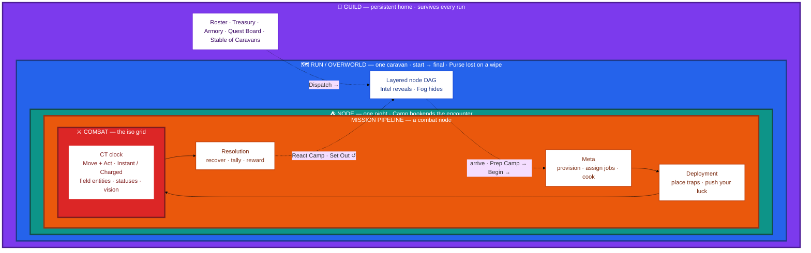

# 00 · The nesting

The master "you-are-here" map. Everything in the game lives at one of five **scales**,
each nested inside the one above it. Read it outside-in: the **Guild** is your permanent
home; each run sends one caravan into the **Overworld**; each stop is a **Node**; a combat
node runs the four-phase **Mission pipeline**; and the third phase *is* **Combat**.

The labelled arrows are the **transition verbs** — the exact buttons that move you between
scales (`Dispatch`, `Begin`, `Set Out`).

## What this shows (and what it defers)

- **Nesting, not detail.** Each scale is drawn just deep enough to place it; the detail
  lives in its own atlas page (`01`–`08`). A **rest** or **event** node skips the Mission
  pipeline entirely — that branch belongs on [`03 · Node kinds`](README.md).
- **The verbs are load-bearing.** `Dispatch` (leave the guild), `Begin` (leave the prep
  camp into the encounter), and `Set Out` (leave the react camp onto the road) are the
  canonical advance verbs from the [glossary](../glossary.md). The two Camp beats live on
  the arrows here; [`05 · Node lifecycle`](README.md) unfolds them.
- **The loop.** `Resolution` feeds back to the map, and the map feeds the next node — the
  run is that loop repeated until the final node (win) or a wipe (run over).

> Maps to: [Design Overview → The loop](../README.md#the-loop).
