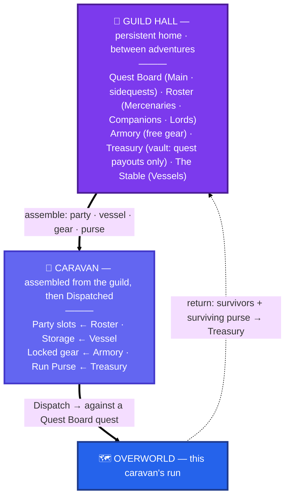

# 01 · Guild / home tier

The persistent **home**, one scale up from a run (the purple frame in
[`00 · The nesting`](00-nesting.md)). It survives every run and **never hard-fails** — stakes
come from permanent *loss*, not a fail screen. Its whole job is to **assemble a caravan** out
of people, gear, and gold, and **Dispatch** it into the overworld.

## Reading it

- **The guild is the buffer; the field is the faucet.** The **Treasury** only grows from
  completed quest payouts — no passive income — and it funds Upkeep, the Armory, and vessel
  upgrades between runs. The **Run Purse** is the separate *flow* you commit to one caravan and
  spend in the field; loot fills it, a **wipe loses it**.
- **Assembling a caravan commits four scarcities at once** — the **slot** (a baker costs a
  warrior; slots are uniform), the **vessel** (which wagon's capacity), the **locked gear** (your
  one good sword can't be in two caravans), and the **purse** (how much treasury gold you risk).
- **Parallel commitment, serial play.** The guild owns several caravans (a `Guild` of N run
  states); you commit people + gear across them at once, but **play one caravan through at a
  time** — the others wait at their node.
- **Three roster tiers set the stakes:** **Mercenaries** (gold-hired, expendable), **Companions**
  (authored, earned not bought — permadeath), **Lords** (campaign-critical — death = game-over).

> Maps to: [systems/guild.md](../systems/guild.md). Detailed on later pages: the roster tiers &
> prestige belong to [`04 · Jobs & prestige`](README.md); the run itself to [`02 · Overworld`](02-overworld.md).
