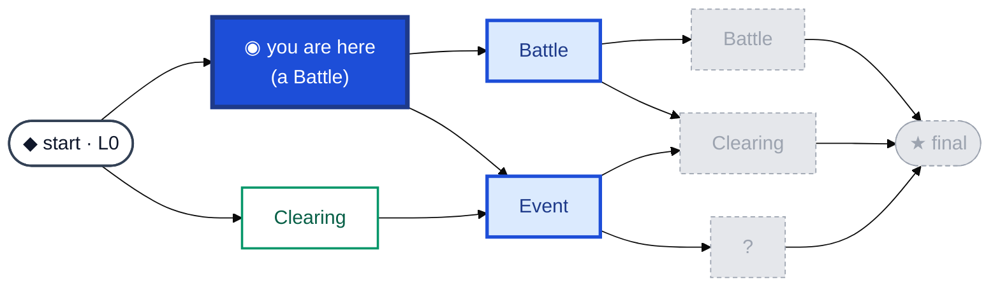

# 02 · Overworld

One caravan's run: a **seeded, layered DAG** of nodes you branch through, from a single
**start** to a single **final**. It doesn't change combat — it only chooses *which encounter to
play next*. Everything is derived from the run seed, so replaying a seed reproduces the same
layout, kinds, and edges.

**Legend** — 🔵 solid = **you are here** · light-blue = **reachable** now (the frontier, always
visible) · ⬜ dashed grey = **fogged** (beyond intel reach, hidden until intel/travel reaches it) ·
left → right = **layer = difficulty** (deeper is harder).

## Reading it

- **Forward-only, never stuck.** Edges only go to the next layer; the generator guarantees every
  non-final node has an outgoing edge (no dead ends) and every non-start node an incoming one (no
  orphans) — so you can always reach the final layer. Extra fan-out adds real branch *choices*
  (and re-merges).
- **Layer 0 is a single start; the final layer is a single node.** Clearing the final node is
  **run-complete**; losing all combat-capable units is a **wipe** (run over — the end screen shows
  the seed to replay).
- **A branch is only a choice if it's informed.** Each reachable node shows a banded
  [intel](../systems/intel.md) preview: **Tier 1** enemy *types* → **Tier 2** the *count* → **Tier
  3** *positions*, plus a reward hint. Rest nodes preview a recovery hint.
- **Reach vs. depth are two intel axes.** *Depth* (above) is how much a previewed node reveals;
  *reach* is how many steps forward you can see at all (`baseReach + tier × step`, ~half the map by
  default). The immediately-reachable nodes are always visible.

> Maps to: [systems/overworld.md](../systems/overworld.md). Node contents are unpacked in
> [`03 · Node kinds`](03-node-kinds.md); what you *do* at each stop is [`05 · Node lifecycle`](05-node-lifecycle.md).
