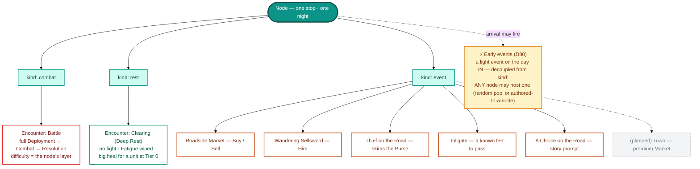

# 03 · Node kinds

What a node on the [overworld DAG](02-overworld.md) can *be*. The menagerie is kept minimal —
**three code kinds** (`combat | rest | event`) — and each kind names its **encounter** by a
player-facing word. On top of that, a light **early event** can ride the arrival of *any* node,
decoupled from its kind.

## Reading it

- **Kind vs. encounter name.** The *code* kind is one of three (`combat | rest | event`); the
  *player-facing* encounter is named by kind — **Battle**, **Clearing**, or an **Event** (a
  **Town** is a planned premium-market node). One combat node runs the whole mission pipeline; a
  rest node runs no fight.
- **Rest = the Clearing.** Its "encounter" *is* the arrival Deep Rest — Fatigue wiped, debt
  cleared, plus a **big heal, but only for a unit at Tier 0** when the rest resolves. That gate is
  what makes "rest the hurt, work the healthy" a real puzzle.
- **Events are a registry.** Each sub-type is data in the M11 event registry — the Thief and
  Tollgate auto-resolve (their cost shows in the Forecast); the Market, Sellsword, and Choice
  present buttons.
- **Early events are orthogonal.** They're *occasional, never every node*, and ride the **day in**
  before the main encounter — a satchel of gold, a pickpocket, a merchant's offer, or an authored
  node-specific beat. A tailored one can even **bypass** the encounter (gated by gold/Influence,
  and you forgo the loot).

> Maps to: [systems/overworld.md → Node kinds](../systems/overworld.md) and the event registry in
> `src/core/node-events.ts`. Event verbs (Buy/Sell/Hire) follow the [glossary](../glossary.md).
