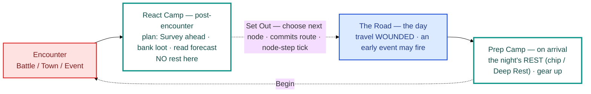

# 05 · Node / travel lifecycle

The **night/day loop** (D46, revised D80) — the beat-by-beat cycle you repeat at every stop. Its
defining rule is **night-after-arrival**: you make camp on *arrival*, so you **travel wounded**
and reaching the next rest is the relief the whole economy is built on. The camp is **two beats**
bracketing the journey — a post-encounter *plan* beat and an on-arrival *prep* beat.

## Reading it

- **The two camps do different jobs.** The **React camp** is *direction* — you **Survey** ahead
  (this is why it's its own beat: you scout *before* you commit a route), read the ledger's
  forecast, and bank loot. The **Prep camp** is *readiness* — the night's rest lands here on
  arrival, then you gear up for the encounter you chose (heal, buy at a Town, set traps).
- **Two advance verbs, two exits.** `Set Out` leaves the react camp (choose route → travel; the
  node-step tick fires here). `Begin` leaves the prep camp into the encounter.
- **Rest is night-after-arrival.** The nightly heal + Fatigue step-down happen at the **prep
  camp**, not after the fight — so you journey wounded and recover at the destination. Real
  recovery still means *routing to a Clearing*; the nightly chip is only a floor, so
  dodge-every-fight stays dead.
- **The Clearing is the special case.** A rest node's "encounter" *is* the arrival Deep Rest, so
  its prep camp and encounter **merge** — no separate `Begin` beat.
- **One node = one node-step.** The camp, the [ledger](../systems/overworld.md), and the route
  forecast all attach to this same seam.

> Maps to: [systems/overworld.md → The node lifecycle](../systems/overworld.md) and the
> [glossary lifecycle table](../glossary.md#lifecycle--the-node-spine-d46-revised-d80).
