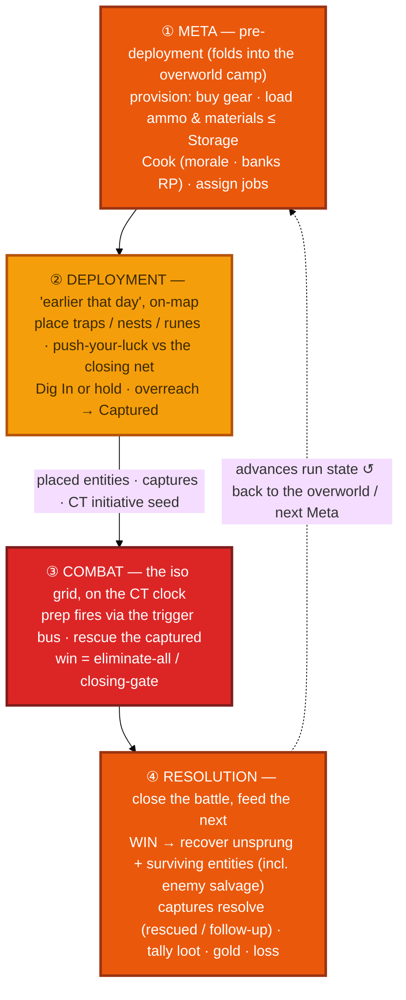

# 06 · Mission phase pipeline

What happens *inside* a combat node — the four ordered phases (decision D3) that run each
mission and loop back into the next. The signature design move is that **most jobs act in a
different phase**: the Cook in Meta, the Survivalist in Deployment, combat classes in Combat.
This is the amber "MISSION PIPELINE" box from [`00 · The nesting`](00-nesting.md), unfolded.

## Reading it

- **Prep in phases 1–2 pays off in phase 3.** Materials provisioned in **Meta** (bounded by
  caravan **Storage**) are placed as [field entities](../systems/field-entities.md) in
  **Deployment**, and those entities **fire during Combat** via the trigger bus. The loop's whole
  character is that the fight is half-decided before it starts.
- **Deployment is a gamble, not free setup.** It runs on the **same board and CT clock** as Combat
  against a **closing enemy net** (D63): range forward for more setup and risk **Capture**, or hold
  safe ground. Its outputs — placed entities, captured units, and the **CT initiative seed** — hand
  straight to Combat (a unit lost to capture lowers your seed, so the enemy acts first).
- **Resolution completes the logistics loop.** A **win** controls the whole field, so you recover
  every unsprung, intact entity (yours *and* the enemy's), auto-rescue still-bound allies, and tally
  rewards; a **loss/flee** recovers nothing and sends captured units to a rescue follow-up. The
  updated run state becomes the next Meta's starting condition.
- **A rest/event node skips this pipeline entirely** — only a **combat** node runs all four phases.

> Maps to: [01-pre-deployment](../01-pre-deployment.md) · [02-deployment](../02-deployment.md) ·
> [03-combat](../03-combat.md) · [04-resolution](../04-resolution.md). Combat's internals are
> unpacked in [`07 · Turn order`](07-turn-order.md) and [`08c · Gameplay layers`](08c-gameplay-layers.md).
