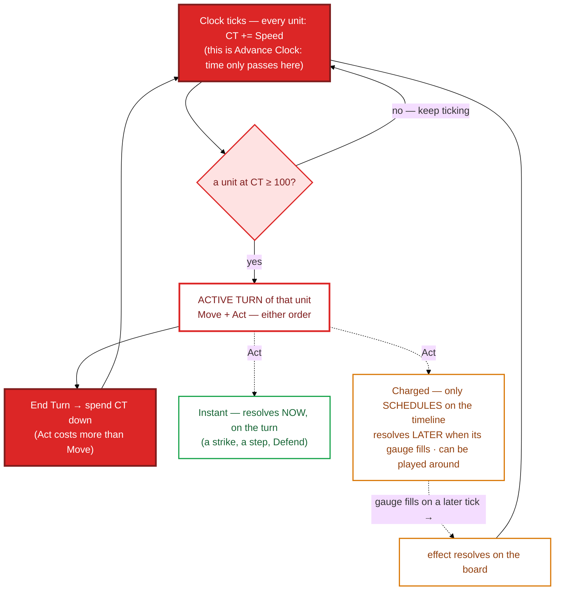

# 07 · Combat turn order (the CT clock)

Combat has **no rounds** (decision D5). It runs on a continuous **Charge-Time** clock: every unit
fills a hidden CT gauge at its **Speed**, and whoever crosses 100 acts next. Speed isn't "go
first" — it's *how often* you act and *how fast* your charged effects land.

## Reading it

- **Two buttons, two jobs.** **End Turn** closes the *active unit's* turn and spends its CT
  (setting when it next acts). **Advance Clock** runs the clock forward — accruing CT, burning
  cooldowns, ticking statuses and charged abilities, taking enemy turns — until the next unit is
  ready. **Time only passes on Advance Clock**; End Turn just hands the clock back. (There is no
  `Wait` — End Turn covers passing.)
- **Instant vs. Charged is the heart of the system.** An **Instant** resolves on your turn. A
  **Charged** ability doesn't fire when you cast it — it *schedules* on the timeline and resolves a
  few ticks later, so the target can move out of the AoE before it lands (a telegraphed, counter-
  playable commit). A **rune** is a charged ability whose charge was pre-paid in Deployment.
- **Entity chains ride the same rail.** When a [field entity](../systems/field-entities.md) sets off
  an adjacent one, the reaction is scheduled onto this clock with a `speed` — `instant` fires now, a
  lower speed becomes a disruptable timer. Combos are just charged abilities by another name.
- **The initiative seed** (set in Deployment from each side's non-captured Speed) decides who reaches
  100 first at `t=0`.

> Maps to: [systems/action-economy.md](../systems/action-economy.md) and the
> [glossary combat section](../glossary.md#combat-d5--the-ct-clock). Numbers (tick rate, CT
> spend-down, charge times) are illustrative tuning values.
