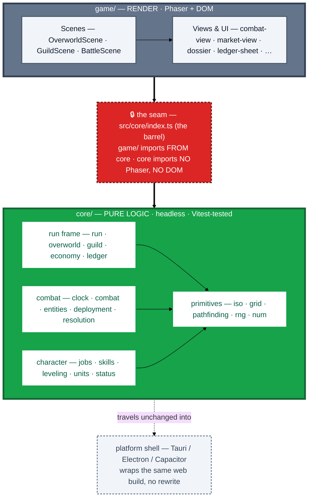

# 08a · Architecture split (whole app)

The load-bearing structural rule of the whole codebase — the same `core/` ↔ `game/` split that
[`08b`](08b-processing-stack.md) draws for one combat frame, here at **app scale**. A pure-logic
`core/` (no Phaser, no DOM) sits under a thin Phaser `game/` render layer. The core is headlessly
testable and travels unchanged into any platform shell.

## Reading it

- **One rule makes it all work:** `core/` never imports Phaser or the DOM. The barrel
  [`src/core/index.ts`](../../../src/core/index.ts) is the single seam `game/` imports from.
  Everything below it is plain data + functions.
- **Why it's worth the discipline.** Because the core is pure, the entire run frame — stats, grid,
  pathfinding, jobs, skills, turn rules, run state — is **unit-tested headlessly** (Vitest, plus the
  `sim` / feasibility harnesses) with no browser, and the same build **wraps into desktop or mobile
  without a rewrite** (web-first, not web-only).
- **`game/` is deliberately thin.** Scenes own input and orchestration; views own drawing. They read
  core state and issue commands to it — they don't hold rules. (The per-frame version of this is
  [`08b`](08b-processing-stack.md).)

> Maps to: [Design Overview → Tech & platform strategy](../../../README.md) and the
> [`src/core/index.ts`](../../../src/core/index.ts) barrel header.
