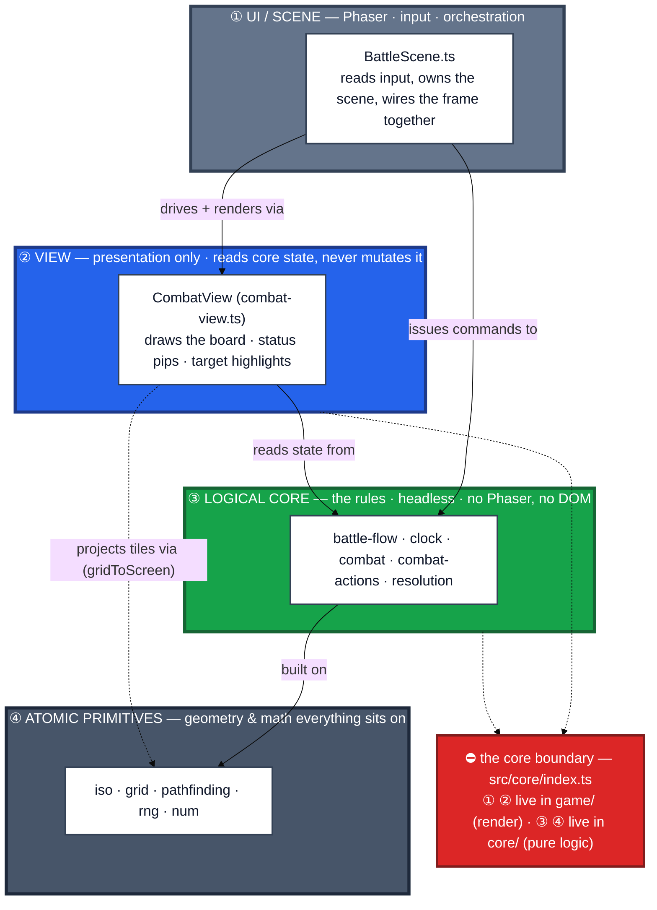

# 08b · Combat processing stack

How a combat frame is actually *built and processed*, top to bottom. This is a
**containment / dependency** view, not a flow: each layer **sits on** the one below and
may only depend downward. The headline invariant — **`core/` never imports Phaser or the
DOM** — is what keeps the bottom two layers headlessly testable and portable into any
platform shell (Tauri, Capacitor, …).

## Reading the stack

- **Dependencies point down only.** `BattleScene` may reach the View and the rules; the
  View may read core state but **never mutates** it (all mutation goes through the rules in
  ③); the rules stand on the primitives in ④. Nothing below ever imports anything above.
- **Two responsibilities cross the boundary.** The Scene **issues commands** downward
  (a player clicks → call a rule in `battle-flow`) and the View **reads state** upward-out
  (the rule returns new `Battle` state → the View redraws). Input goes down; state comes back.
- **The barrier is enforced, not aspirational.** The core barrel
  [`src/core/index.ts`](../../../src/core/index.ts) is the seam: `game/` imports *from* it,
  and its header forbids core from reaching into Phaser or the DOM. That single rule is why
  ③ + ④ are unit-tested headlessly and travel unchanged into a desktop/mobile wrapper.

> This is one of **three** combat-layer views. `08a` draws the same `core/` ↔ `game/` split
> at the whole-app scale; `08c` draws the *gameplay* layers (CT clock → actions → field
> entities → statuses → vision). Maps to: [Design Overview → Tech & platform strategy](../../../README.md).
