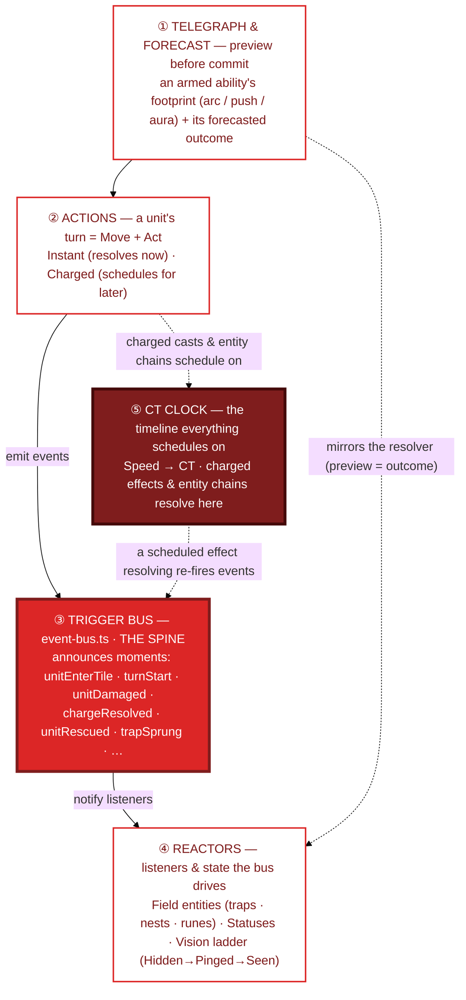

# 08c · Combat gameplay layers

The *gameplay* systems inside a fight and how they stack — from the player-facing preview at the
top down to the engine at the bottom. Unlike a strict dependency stack, combat has a **spine**: the
**trigger bus** is the hub everything talks through, and the **CT clock** is the timeline everything
schedules on. Read the arrows, not just the layers.

## Reading it

- **The trigger bus (③) is the architectural hook (D4).** The combat loop announces moments; field
  entities, Cook buffs, and future placeables are just **listeners**. Adding a new placeable is
  adding *data*, not a new system. The bus is wired and load-bearing today.
- **The CT clock (⑤) is where time-shifted things land.** [Charged abilities](07-turn-order.md),
  runes (pre-paid charges), and entity chains all **schedule onto the clock with a `speed`** —
  instant fires now, a lower speed becomes a disruptable timer. When one resolves, it re-fires bus
  events, which can drive more reactors: the bus↔clock loop is the engine of combat.
- **Reactors (④) are the game state prep touches.** Traps/nests/runes are entities placed in
  Deployment; **Statuses** (Immobilized, Guarded, Exposed, …) are applied effects; the **Vision
  ladder** gates who can see and target whom (a Direct attack needs *Seen*; an AoE can catch a
  *Pinged* tile).
- **Telegraph (①) mirrors the resolver.** The preview you see before committing is generated from
  the *same* logic that resolves the ability — so what you're shown is what you'll get (D64).

> Maps to: [field-entities](../systems/field-entities.md) · [action-economy](../systems/action-economy.md)
> · [telegraph](../systems/telegraph.md) · [vision](../systems/vision.md). Some reactors (nests,
> runes, the full vision ladder) are *designed, not built* — see each system doc.
