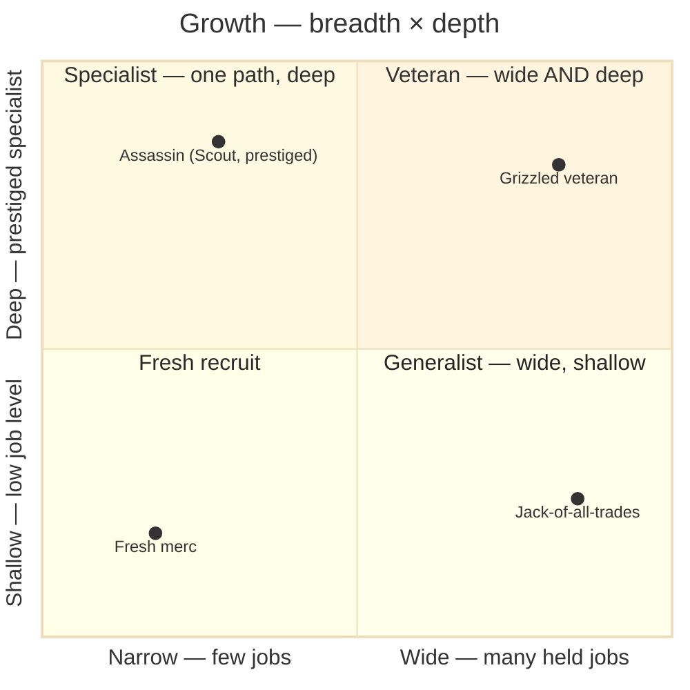

# 04a · The two axes — breadth × depth

Character growth runs on **two axes that must not blur**. Keeping them orthogonal is the whole
legibility guarantee: **prestige never widens breadth, and gaining a job never deepens a kit in
place.**

## Reading it

| Axis | Rides on | The verb | Fantasy |
|---|---|---|---|
| **Breadth** (→ right) | **character** level → **loadout slots** | a new job **adds** kit parts | the **generalist** — collect & mix |
| **Depth** (↑ up) | **job** level → **Prestige** | prestige **replaces** kit parts in place | the **specialist** — grow one path deep |

- **`add` vs `replace` is the load-bearing distinction.** Picking up a third job **adds** kit
  through a loadout slot (bounded by the slot economy). Prestiging a job **replaces** ≥1 element of
  that one job's kit **in place** — the job count and the kit-element count both stay flat.
- **They can't buy each other.** A unit that prestiges its primary still borrows the *same number*
  of secondary abilities it did before; a unit that picks up another job has not made any single
  job stronger. That's why the four corners are reachable independently — you choose *wide*, *deep*,
  *both*, or *neither*.
- **Breadth is gated by loadout slots** (character level); **depth is gated by a job-level floor**
  (then a prestige trigger — see [`d · Prestige`](04-prestige.md)).

> Maps to: [systems/jobs.md → Two axes](../../systems/jobs.md). The slot economy is the FFT
> secondary-ability projection (`leveling.ts`) — the one piece still "a later pass."
