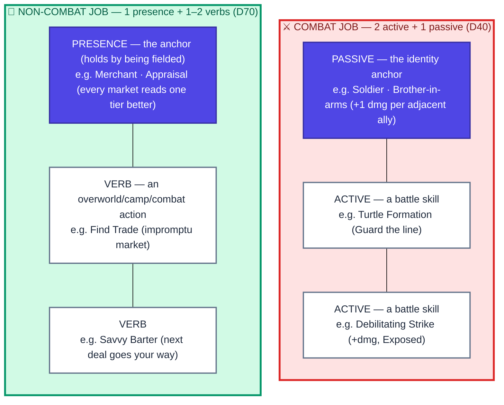

# 04b · A job's kit anatomy

Every job is authored to one of **two house styles** — a *combat* shape and a *non-combat* shape.
They're the same idea (**one identity anchor + one or two things you do**) in two mediums. The shape
is a **guideline, not a hard rule**: the roster already bends it (the Scout carries a deployment
snare on top of two battle actives), and that flex is *wanted*.

## Reading it

- **The anchor carries the identity.** For a **combat** job it's the **passive** (a rule that's
  always on — Brother-in-arms, Deadeye, Quiet Footsteps). For a **non-combat** job the passive has
  no battle to live in, so the anchor is a **presence effect** — a benefit that holds *while the
  unit is fielded* (Appraisal's market lift, the Noble's Renown Influence trickle). Same role, two
  mediums.
- **The actives are what you *do*.** Combat actives are entries in the `skills` array (they cost CT
  on the clock). Non-combat "actives" are **verbs** gated outside `skills` and paced by the
  overworld limiter (cooldown / per-node cap / a price in fatigue · gold · Influence · RP).
- **A verb can live on any surface.** The Noble generalizes the shape: **Patronize** is a *camp*
  verb, **Bribe** a *combat* verb — "1 presence + 1–2 verbs, where a verb may be camp **or**
  battle."
- **Prestige keeps the count flat** by swapping elements, not adding them (see
  [`d · Prestige`](04-prestige.md)); held jobs add elements only through **loadout slots**.

> Maps to: [systems/jobs.md → A job's kit](../../systems/jobs.md). Worked cases: Soldier (D66),
> Merchant (D70), Cook & Noble (D71).
