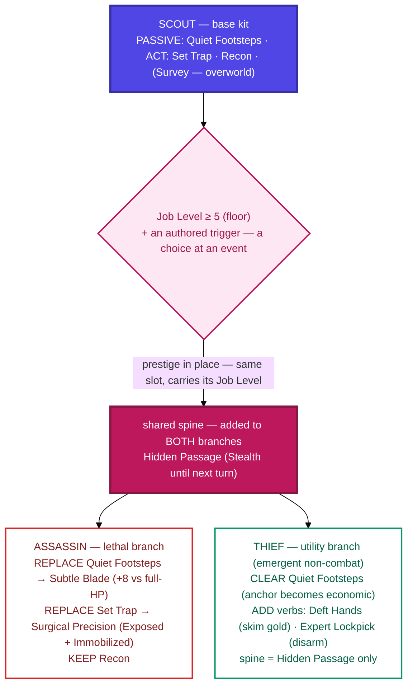

# 04d · Prestige — the depth capstone

**Prestige is growing a job into a successor, and it replaces in place.** It is *not* a new held
job and *not* a level-up — the character and the slot stay the same, the kit changes. A branch is
authored as a **diff on the base kit**: **replace ≥1 element, keep the rest**. Because it's a diff,
the kit-element count stays flat, and sibling branches read as *related but distinct* — a shared
spine, a swapped edge.

The only *built* fork today is the Scout's — the worked example below.

## Reading it

- **Diff, not addition.** Assassin **replaces** two base elements and keeps one; Thief **clears** the
  passive and swaps in economic **verbs**. Both **add** the shared **Hidden Passage** spine — which
  is why they feel like siblings. The base count (≈2 active + 1 passive) survives prestige with no
  extra bookkeeping.
- **In place, carrying the grind.** The successor occupies the **same slot** and **keeps its Job
  Level** — you don't restart. It evolves *the* job; it isn't a second job stacked on top (stacking
  was rejected — it would couple the two axes and blow the slot budget).
- **Chains are just recursion.** A prestige job is itself a job, and any job may carry a branch — so
  **tier 1 → tier 2 → tier 3** is the same seam applied again. How many job levels sit *between*
  hops (so a capstone feels earned) is per-class pacing, deferred to each class pass.
- **Non-combat prestige deepens *verbs*, not a battle kit** — replace-in-place applied to the
  economy verbs (Merchant/Cook/Noble forks are reserved).
- **Earned, never auto-flipped.** Hitting the floor doesn't transform you — prestige is a **choice
  at an event**, and both forks run the **same two-beat mentor sequence**: an *arm-early* beat under
  a low gate that only writes a memory flag, then a *fire-later* beat gated on `floor + flag` that
  actually prestiges in place. The Assassin **walks-then-reveals** (travelling-companion → the
  reveal); the Thief **contacts-then-rites** (`guild-contact`, gate `scout ≥ 1`, writes the
  `thieves-guild-invite` flag → `guild-rite`, gate `scout ≥ 5 + invite`, fires the prestige). Each
  beat's predicate is one gate on the [grant seam](README.md).

> Maps to: [systems/jobs.md → Prestige](../../systems/jobs.md),
> [`src/core/jobs-data/scout-line.ts`](../../../../src/core/jobs-data/scout-line.ts) (the built fork),
> and the pinned mentor beats in
> [`src/core/node-events.ts`](../../../../src/core/node-events.ts) (the `pinnedStoryEvent`
> `guild-contact`/`guild-rite` registrations) over
> [`src/core/stories.ts`](../../../../src/core/stories.ts) (`THIEVES_GUILD_CONTACT` / `THIEVES_GUILD_RITE`).
