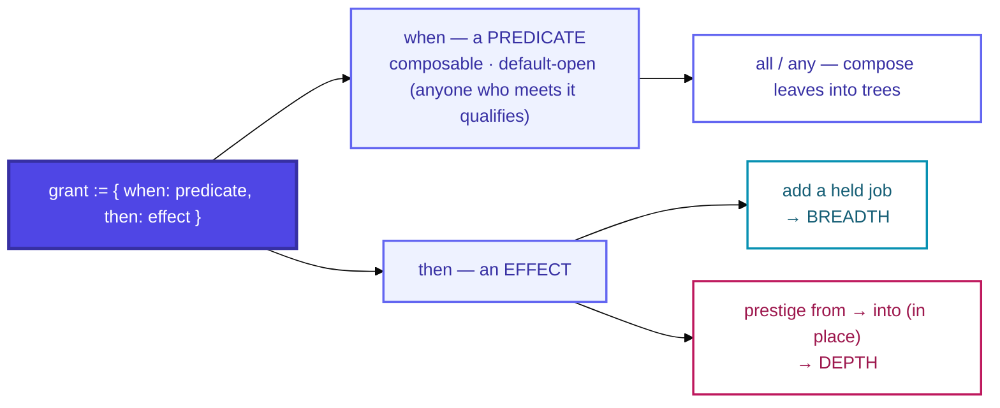
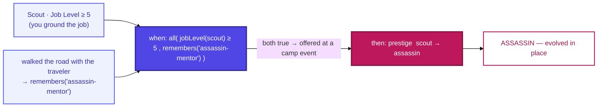

# 04e · The grant seam

Both **acquiring a base job** (breadth) and **triggering a prestige** (depth) run through **one
piece of machinery**: an eligibility **predicate** guarding an **effect**. This is why the mundane
(grind-to-prestige) and the bespoke (a legendary path authored for one hero) need no separate
systems — they're the same shape with a different predicate.

## A worked example — the built Scout → Assassin fork

The same shape, filled in with a **real grant** (`scout-line.ts`):

> Read it: *IF the unit has Scout at level 5+ **and** remembers the assassin-mentor beat, **THEN**
> it may prestige Scout → Assassin.* The **Thief** sibling is the **identical shape with a different
> flag** (`thieves-guild-invite`) — same seam, swapped predicate, which is exactly why the two forks
> read as related.

## The predicate kinds

Leaves read the **unit** or the **run/context**; `all` / `any` compose them.

| Predicate | Reads | Use | Example |
|---|---|---|---|
| `jobLevel ≥ N` | unit | **the default** prestige trigger | grind the job, earn its capstone |
| `charLevel ≥ N` | unit | authored coming-of-age | the nomad child joins the hunt at L5 → Hunter |
| `holdsItem(x)` | run inventory | the **Master-Seal** pattern (consumed) | a recipe book grants Cook |
| `atNode(x)` / `atNodeKind(k)` | position | a special node or node kind | the thieves'-guild node |
| `unitId(x)` | unit | **select characters** | a one-off path only *they* can take |
| `remembers(flag)` | unit memory | linked events | *helped the beggar* → later *invited to the guild* |
| `flagSet(flag)` | run | a run-scoped switch | a story gate opened this run |
| `all` / `any` | — | compose | `jobLevel ≥ 5` **and** `remembers("mentor")` → Assassin |

## Reading it

- **One seam, two effects.** `then` is either *add a held job* (widens **breadth**) or *prestige
  from → into* (deepens **depth**, replacing in place). Same guard, opposite axis.
- **Default-open, so power is never a tier dividend.** Anyone meeting a predicate qualifies — the
  whole tree is available to mercenaries and the authored cast alike. A `unitId` / story predicate
  is **power-neutral plumbing**: it may host a genuinely strong one-off, **but only when a
  story earns it** (see [`f · Acquisition`](06-acquisition.md)).
- **"Special for one hero" needs zero new machinery** — it's just a predicate keyed on identity or
  a story flag. The Scout fork uses exactly this: `all(jobLevel ≥ 5, remembers("assassin-mentor"))`.

> Maps to: [`src/core/grants.ts`](../../../../src/core/grants.ts) (the `Predicate` union) and
> [systems/jobs.md → One seam](../../systems/jobs.md).
