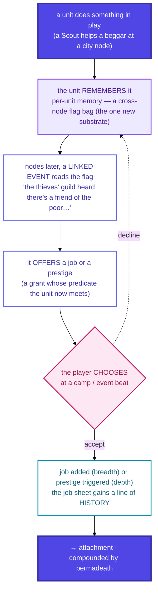

# 04f · Acquisition & attachment

Jobs arrive **through play, not a menu** — and that's not flavor, it's the **attachment engine**. A
unit's job sheet becomes a *history*, and history is what makes a unit feel *yours*. It compounds
with permadeath (D27): loss only hurts when you're invested.

## Three agency levels

Where the *ownership* accrues depends on how the job arrives — and the level should match the
content:

| Level | How it fires | Right for | Example |
|---|---|---|---|
| **Automatic** | on a threshold, no prompt | **authored** story beats (it's a reveal) | coming-of-age at char-level 5 |
| **Item-spent** | consume a held item | generic acquisition | a **recipe book** → Cook |
| **Player-chosen** | pick at an event | generic acquisition | the guild's job offer |

> **Ownership accrues in the choosing** — so generic acquisition should usually **cost a choice or
> an item**, while automatic is reserved for authored reveals.

## Reading it

- **Per-unit memory is the only new substrate.** A cross-node flag bag lets a *later* event read
  what an *earlier* one wrote (the beggar → guild chain). Everything else reuses existing seams (the
  predicate kinds, the job registry, the loadout economy, per-job levels). Its exact shape — what a
  memory entry holds, how long it persists — is deferred.
- **Declining isn't losing.** The remembered flag persists, so an offer can resurface — the choice
  stays yours.
- **The Assassin path is the two-step version:** walk the road with a stranger first (a remembered
  flag), and *only then* the reveal — the traveler was an assassin — offers the mentorship. Linked
  memory gates the second event on the first.

> Maps to: [systems/jobs.md → Acquisition is diegetic / Per-unit memory](../../systems/jobs.md).
