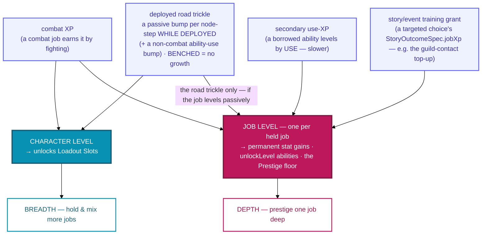

# 04g · Leveling & XP routing

Two levels, feeding the [two axes](01-axes.md). **Character level** governs how *wide* a unit can
go; **job level** (one per held job) governs how *deep* a single path can go. They're fed by
different XP, and the routing is what keeps the axes honest.

## Reading it

- **Character level → loadout slots → breadth.** More slots = room to hold and mix more jobs'
  abilities. This is the *width* dial; it never deepens any single kit.
- **Job level → prestige → depth.** Each held job tracks its **own** level with **permanent stat
  gains** and `unlockLevel`-gated abilities, and reaching a job-level **floor** opens its
  [Prestige](04-prestige.md). This is the *depth* dial; it never widens breadth.
- **XP routes by how you play.** A **combat** job levels by fighting; a **borrowed/secondary**
  ability levels by *use* (slower, since the primary is mostly active). The **deployed road trickle**
  (a bump per node-step) feeds **character** level for *every* fielded unit — travelling *broadens*
  you — and **also** the bearer's **primary job**, but only if that job **levels passively**
  (`JobDef.passiveXp`, the non-combat trades: Survivalist · Cook · Merchant · Noble · Banker). A
  **combatant never earns job-XP from walking** — it levels its job by fighting. **Benched = no
  growth** — sitting in the guild is never free training, so fielding a support unit is a real
  commitment.
- **A story/event choice can grant job-XP directly.** A targeted outcome's `StoryOutcomeSpec.jobXp`
  (e.g. the `guild-contact` beat's modest scout top-up) calls the same `grantJobXp` — an **earned
  top-up** for taking the offer, not a conjured level: it feeds normal XP into the routing and levels
  only if it clears the next threshold.
- **Prestige carries the job level** with it (the successor keeps the grind — see
  [`d · Prestige`](04-prestige.md)); acquiring a *new* job starts it at job-level 1.

> Maps to: [systems/guild.md → Classes, secondary jobs & leveling](../../systems/guild.md) and
> [systems/jobs.md](../../systems/jobs.md), over
> [`src/core/leveling.ts`](../../../../src/core/leveling.ts) (`accrueDeployedXp` routes the road
> trickle to the character axis + a `passiveXp` primary job, D93). The ability-borrowing
> *projection* into slots is the one piece still "a later pass".
